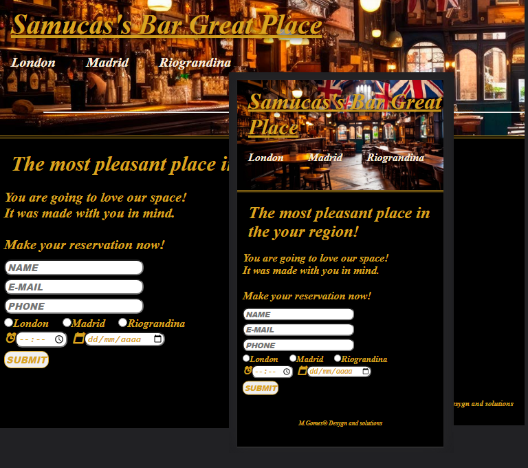

<h1 align="center"> Reservation Register </h1>

"Reservation Register" é um projeto que serve para auxiliar no registro de reservas, bom como a confirmação de presença em eventos à convidados.

  <a href="#-tecnologias">Tecnologias</a>&nbsp;&nbsp;&nbsp;|&nbsp;&nbsp;&nbsp;
  <a href="#-projeto">Projeto</a>&nbsp;&nbsp;&nbsp;|&nbsp;&nbsp;&nbsp;
  <a href="#-layout">Layout</a>&nbsp;&nbsp;&nbsp;|&nbsp;&nbsp;&nbsp;
  <a href="#memo-licença">Considerações</a>

  

 

  

## 🚀 Tecnologias

Esse projeto foi desenvolvido com as seguintes tecnologias:

- HTML e CSS
- JavaScript
- Git e Github
- FormSubmit

## 💻 Projeto

Reservation Register é uma página que contém um formulário simples para cadastro. 
Os dados são enviados para um e-mail cadastrado através da ferramenta 'formSubmit'   

-[Visite o projeto online](https://celo-gomes.github.io/reservation)

## 🔖 Layout

Layout desenvolvido com simplicidade, visando apenas a fluidez de utilização pelo usuário. A futuro poderá ter arquivos css e script com melhor organização e visando uma melhor definição, ao contrário de hoje, que possui seu estilo e funções independentes por página.

## :memo: Considerações.

Esse projeto está sob a licença MIT. 

---

Feito com ♥ by M. Gomes :wave: [Visite no GitHub!](https://github.com/celo-gomes)
